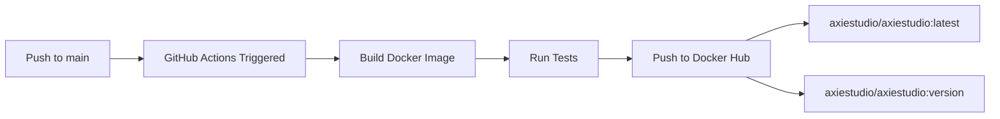

# 🚀 GitHub Actions Configuration for Main Branch

## ✅ **DOCKER HUB DEPLOYMENT ENABLED**

The GitHub Actions workflows are now properly configured to automatically build and push Docker images to Docker Hub when code is pushed to the **main** branch.

## 🔧 **CONFIGURED WORKFLOWS**

### **1. Primary Docker Build & Push Workflow**
**File:** `.github/workflows/docker-build.yml`

**Triggers:**
- ✅ **Automatic on push to `main` branch**
- ✅ **Automatic on push to `master` branch** 
- ✅ **Manual workflow dispatch**

**Features:**
- 🐳 **Builds and pushes to Docker Hub** (`axiestudio/axiestudio`)
- 🏗️ **Multi-platform builds** (linux/amd64, linux/arm64)
- 🏷️ **Automatic version tagging** from pyproject.toml
- 📦 **Multiple image variants:**
  - `axiestudio/axiestudio:latest`
  - `axiestudio/axiestudio:version`
  - `axiestudio/axiestudio-backend:latest`
  - `axiestudio/axiestudio-frontend:latest`

**Docker Hub Images Created:**
```
axiestudio/axiestudio:latest
axiestudio/axiestudio:1.x.x
axiestudio/axiestudio-backend:latest
axiestudio/axiestudio-frontend:latest
```

### **2. Docker Image CI Workflow**
**File:** `.github/workflows/docker-image.yml`

**Triggers:**
- ✅ **Push to `main` branch** (newly added)
- ✅ **Push to `master` branch** (newly added)
- ✅ **Pull requests to `main` branch** (newly added)

**Features:**
- 🧪 **Basic Docker build testing**
- ✅ **Validates Dockerfile syntax**

### **3. Release Workflow**
**File:** `.github/workflows/release.yml`

**Features:**
- 🎯 **Manual release triggers**
- 📦 **AxieStudio package releases** (updated from Langflow)
- 🐳 **Docker image releases**

## 🔐 **REQUIRED SECRETS**

Make sure these secrets are configured in your GitHub repository:

```
DOCKERHUB_USERNAME=your-dockerhub-username
DOCKERHUB_TOKEN=your-dockerhub-access-token
```

**To configure secrets:**
1. Go to your GitHub repository
2. Settings → Secrets and variables → Actions
3. Add the required secrets

## 🚀 **AUTOMATIC DEPLOYMENT FLOW**



## 📋 **DEPLOYMENT CHECKLIST**

### **✅ Completed:**
- [x] Docker build workflow configured for main branch
- [x] Docker Hub push enabled
- [x] Multi-platform builds (AMD64 + ARM64)
- [x] Automatic version tagging
- [x] Backend/Frontend component builds
- [x] Updated workflow names from Langflow to AxieStudio

### **🔧 Required Setup:**
- [ ] Configure DOCKERHUB_USERNAME secret
- [ ] Configure DOCKERHUB_TOKEN secret
- [ ] Verify Docker Hub repository exists: `axiestudio/axiestudio`

## 🎯 **NEXT STEPS**

1. **Force push to main branch** (current step)
2. **Verify GitHub secrets are configured**
3. **Push triggers automatic Docker build**
4. **Monitor GitHub Actions tab for build status**
5. **Verify images appear on Docker Hub**

## 📊 **MONITORING**

After pushing to main, monitor:
- **GitHub Actions tab** for build status
- **Docker Hub repository** for new images
- **Build logs** for any errors

## 🔗 **USEFUL LINKS**

- **GitHub Actions:** `https://github.com/YOUR_USERNAME/YOUR_REPO/actions`
- **Docker Hub:** `https://hub.docker.com/r/axiestudio/axiestudio`
- **Workflow Files:** `.github/workflows/`

---

**🎉 Your main branch is now configured for automatic Docker Hub deployment!**
